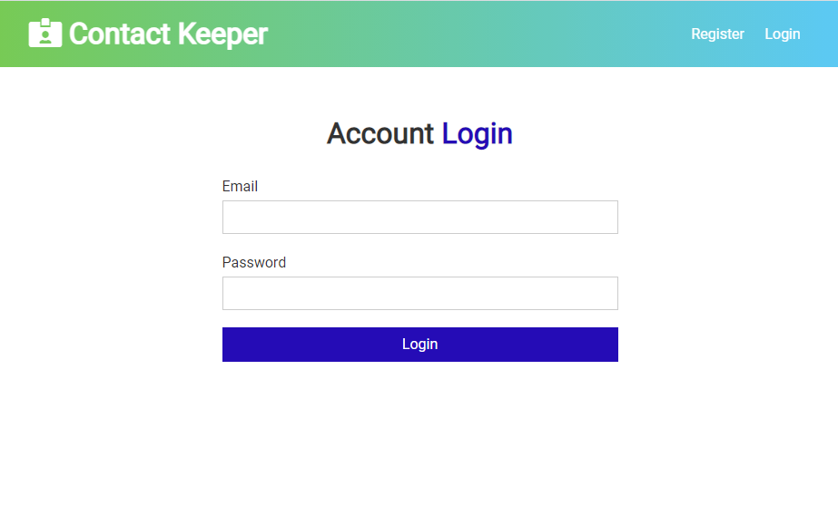

# Contact keeper
Fullstack MERN contact manager built with React hooks, context and JWT authentication.

### Setup

To run this project, install it locally using npm:
```
$ npm install
$ npm client-install
```
### Database setup

Include your MongoDB URI in /config/default.json file.
### Run server

Include your MongoDB URI in /config/default.json file.

```
$ npm run dev
```
### Source

Built during "Modern React Front To Back" course by [Brad Traversy](https://www.traversymedia.com/)